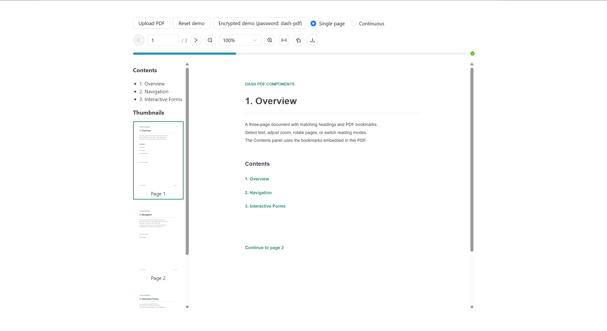
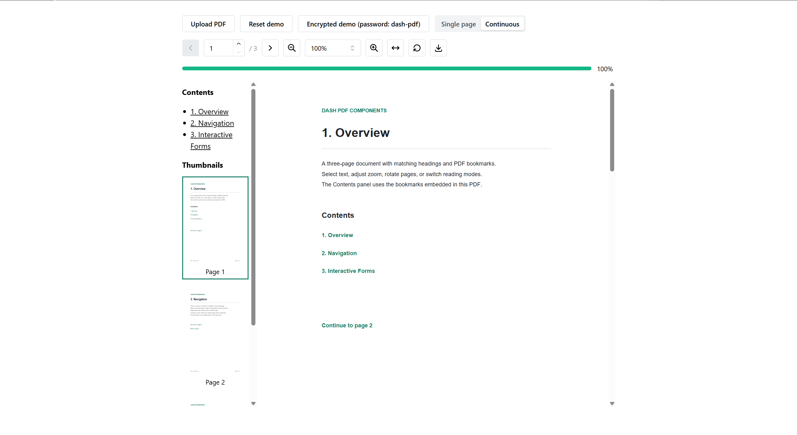

# dash-pdf-components

Lightweight React-PDF rendering components for Plotly Dash.

```bash
uv add dash-pdf-components
```

For the common single-page viewer, use `PDF`:

```python
import dash_pdf_components as dpc

dpc.PDF(
    id="pdf",
    file="/assets/document.pdf",
    pageNumber=1,
    width=720,
)
```

`PDF` combines document loading and one rendered page. Navigation controls can update `PDF.pageNumber`, `PDF.scale`, and `PDF.rotate`; callbacks can read `PDF.numPages`, `PDF.loadProgress`, `PDF.pageData`, `PDF.renderData`, and `PDF.errorData` from the same component.

## API

Use the smallest API that fits the layout:

| Component | Use case |
| --- | --- |
| `PDF` | Default single-page viewer and callback target |
| `Document` | Shared PDF context for custom or continuous layouts |
| `Page` | One page inside `Document` |
| `Thumbnail` | Clickable page preview inside `Document` |
| `Outline` | PDF table of contents inside `Document` |

`PDF` accepts the commonly used React-PDF options directly: `file`, `pageNumber`, `width`, `height`, `scale`, `rotate`, `renderTextLayer`, `renderAnnotationLayer`, `renderForms`, `loading`, `error`, and `noData`. Advanced PDF.js loading options remain available through `options`, `assetBaseUrl`, and `workerSrc`.

Use the composable API only when the layout needs multiple pages, thumbnails, or an outline:

```python
dpc.Document(
    [
        dpc.Outline(),
        dpc.Thumbnail(pageNumber=1, width=120),
        dpc.Page(pageNumber=1),
        dpc.Page(pageNumber=2),
    ],
    file="/assets/document.pdf",
)
```

The package intentionally has no toolbar, theme system, locale system, or Ant Design dependency. Build navigation, zoom, rotation, and download controls with ordinary Dash components. See [`usage.py`](usage.py) for a complete example.

## Reader demo

The demo includes PDF upload, an encrypted document (password: `dash-pdf`), page navigation, zoom, rotation, download, bookmarks, thumbnails, and single-page or continuous reading. It uses Ant Design when `dash-antd-components` is installed, otherwise Mantine when `dash-mantine-components` is installed. These UI libraries are optional and are not package dependencies.

Install either UI library and run the demo:

```bash
pip install dash-pdf-components dash-ant-design
python usage.py
```

For Mantine:

```bash
pip install dash-pdf-components dash-mantine-components dash-iconify
python usage.py
```

When both libraries are installed, Ant Design is selected by default. Set `PDF_UI=antd` or `PDF_UI=mantine` to choose explicitly, for example `PDF_UI=mantine python usage.py`. Keep the [`assets`](assets) directory alongside `usage.py`; it contains the demo PDFs and shared reader styles and callbacks. For a source checkout, build the components using the development commands below before running the demo.

### Ant Design



### Mantine



React-PDF uses PDF.js internally. The matching Worker, character maps, standard fonts, WASM, ICC profiles, and annotation images load from this package by default. Set `assetBaseUrl` on `PDF` or `Document` to replace them with a version-matched CDN:

```python
dpc.PDF(
    file="/assets/document.pdf",
    assetBaseUrl="https://registry.npmmirror.com/pdfjs-dist/5.4.296/files/",
)
```

`workerSrc`, `imageResourcesPath`, and individual `options` values such as `cMapUrl`, `standardFontDataUrl`, `wasmUrl`, and `iccUrl` override the defaults. These options are also available on `Document`.

Internal PDF links navigate automatically. `PDF` and a single rendered `Page` switch to the destination page, while documents rendering multiple pages scroll to the mounted destination. `itemClickData` remains available for observing navigation.
